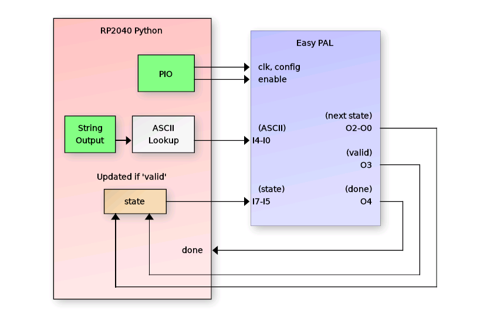
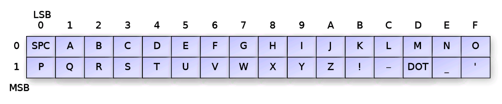

# tt06-PAL-testing

This repo is a unit test for the TinyTapeout TT06 "Easy PAL" design submitted 
by Matthias Musch (design #236).  

## Test Method

The Easy PAL is an 8 input, 5 output 11 product term PAL that is programmable 
via 231 internal D flip flops arranged in a shift-register chain for progamming.
The author wrote and provided a Python application for generating the required bit
stream from input logic equations.  

The test works by implementing a 3-bit (8-state) Finite Statate Machine (FSM) using
a "3-bit" register impelmented in Python.  The 3 bits of current state are fed to the
PAL on inputs I7-I5 with other inputs provided on I4-I0.  The PAL then calculates the
"next state" on outputs I2-I0 with a "valid" signal on I3 indicating when the new
state should be saved to the state registers.  

Using this FSM impelmentation, the Python code feeds a string to the PAL using a modified
ASCII representation (since we only have a 5-bit input).

The Python code uses a PIO program that implements a shift register programming interface
using a single SM with joined FIFOs from both RX and TX for a total of 8 32-bit FIFO words
(max 32 bytes).  The PAL bitstream is 231 bits (28 bytes) so this fits within a single
transaction.

After programming the PIO fifo and issuing an IRQ 0 (to kick it off), the Python code
starts feeding modified ASCII plus current state inputs to the PAL, monitoring the output
for success.  It reports the status of each byte / state combination as well as the state
of the 'done' bit and pass/fail.

## Example run
    >>> from pal_test import *
    >>> be_a_PAL(tt)
    ttboard.project_mux: Enable design tt_um_MATTHIAS_M_PAL_TOP_WRAPPER
    ttboard.demoboard: Resetting system clock to default 1.25e+08Hz
    ttboard.demoboard: First time loading: Toggling project reset
    ttboard.demoboard: Changing reset to output mode
    ttboard.demoboard: Changing reset to output mode
    uo_out
    ui_in
    uio_in
    uio_out
    i_clk
    i_config
    i_enable
    i_ascii
    i_state
    o_state
    o_valid
    o_done
    o_all
    ttboard.demoboard: Changing reset to output mode
    ================================================
    Testing target string HELLO WORLD
    ================================================
    H ✅  E ✅  L ✅  L ✅  O ✅    ✅  W ✅  O ✅  R ✅  L ✅  D ✅
    Done bit detected
    Test passed! 👍

    ================================================
    Testing other strings to ensure they don't work
    ================================================
    Trying: "DUBIOUS"
    D ❌  U ❌  B ❌  I ❌  O ❌  U ❌  S ❌
    Done bit not set
    Test passed! 👍

    Trying: "NOPE!"
    N ❌  O ❌  P ❌  E ❌  ! ❌
    Done bit not set
    Test passed! 👍

    Trying: "DON'T BOTHER"
    D ❌  O ❌  N ❌  ' ❌  T ❌    ❌  B ❌  O ❌  T ❌  H ✅  E ✅  R ❌
    Done bit not set
    Test passed! 👍

## Generating your own tests

In the bitstream_gen directory, I have placed a modified version of Matthias' 
script for generating PAL programming bit streams from input equations.  In 
addition, I wrote a generator to create the required input equations for any
string (up to 11 characters with all characters only using the modified ASCII
set).  The FSM generator automatically calls the modified bitstream generator
and creates an output .py file.  The output .py file can be copied directly to
the demoboard and used as the input configuration. Here is an example (Linux):

    cd bitstream_gen
    python3 -m venv venv
    . venv/bin/activate
    python3 -m pip install pyeda
    python3 fsm_generator.py "MY FIRSTFSM" firstfsm.txt
    cp firstfsm.py ../pal_test
    cd ..
    mpremote -r pal_test :

Then from the RP2040 Micropython REPL:

    >>> from pal_test import *
    >>> from pal_test.firstfsm import *
    >>> be_a_PAL(tt, my_firstfsm_config())

The 'be_a_PAL' function can also be called with a config number.  There are two 
default configurations pre-loaded and you can edit be_a_PAL.py to add additional
configs if you wish:

    be_a_PAL(tt, 0)    # Runs the HELLO WORLD config
    be_a_PAL(tt, 1)    # Runs the DON'T PANIC config

## SpASICs

A version of this test was submitted to SpASICs for testing the PAL design in
space, though that version was prior to writing the PIO configuration program, so
it takes several seconds for "bit-bang" programming fronm pure Python.

Included in the SpASICS test are "HELLO SPACE" and "DON'T PANIC" configurations,
selectable using the first argument byte.  For each configuration, a specific
response is returned.  A failure message is reported if the config fails:

 - HELLO SPACE:   returns: Why Hello!
 - DON'T PANIC:   returns: 42
 - Failure:       returns: Fail with the state number and byte it failed on

